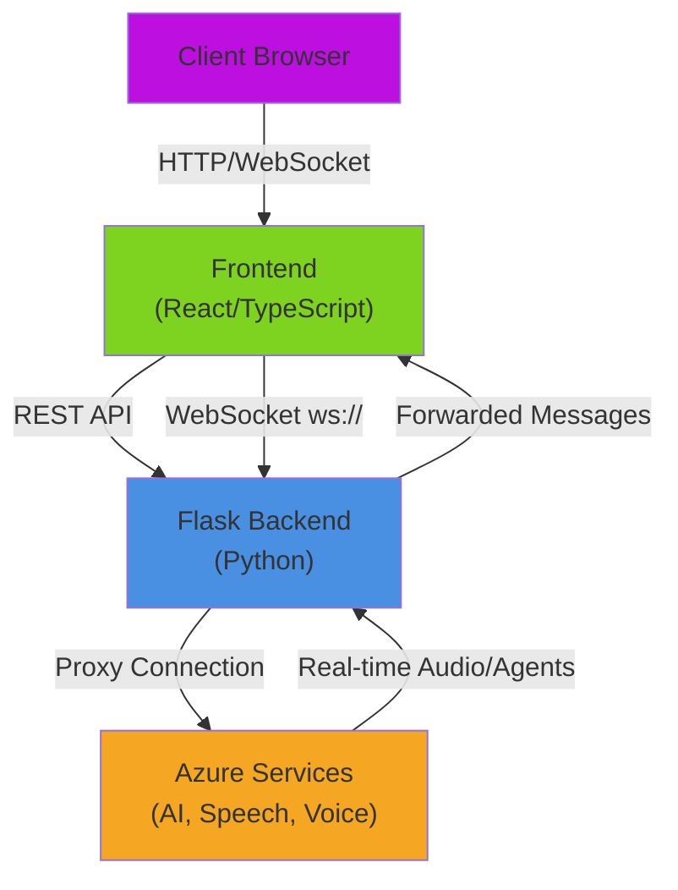
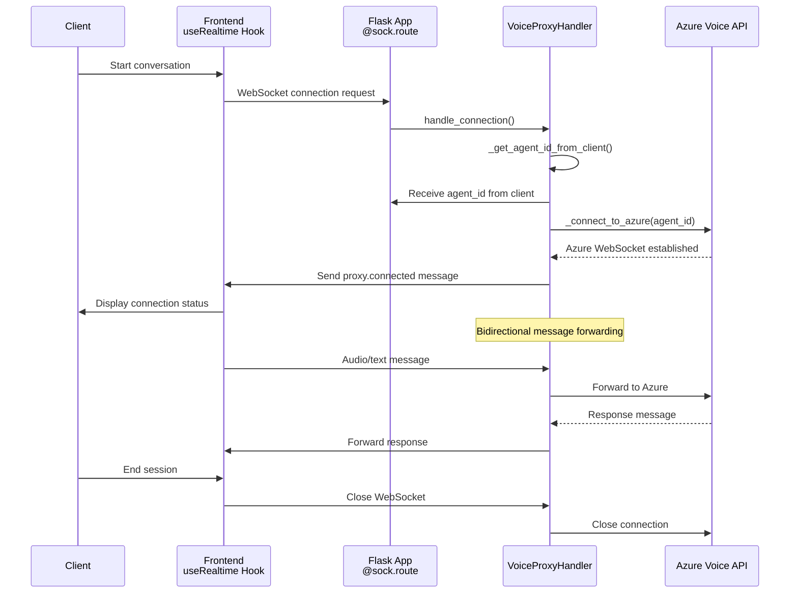
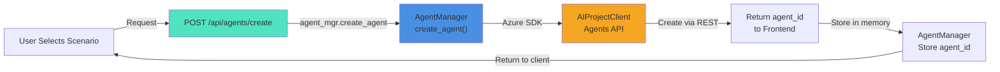
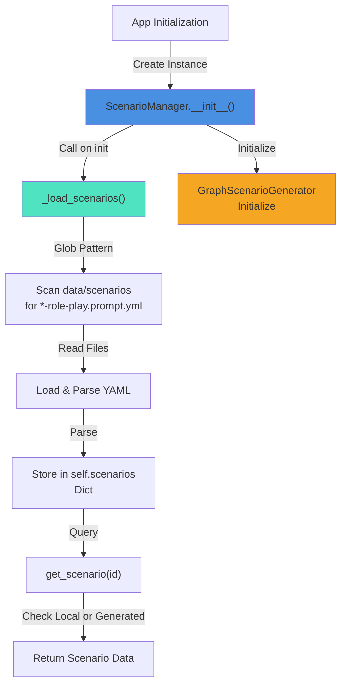
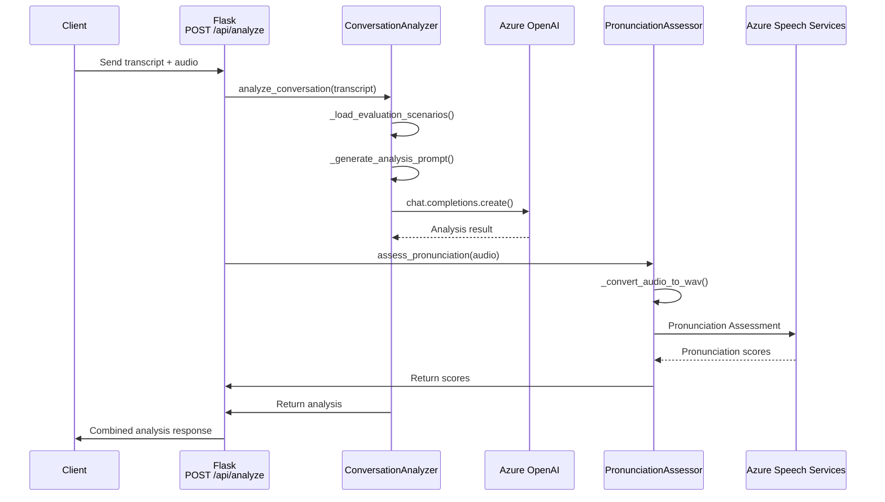
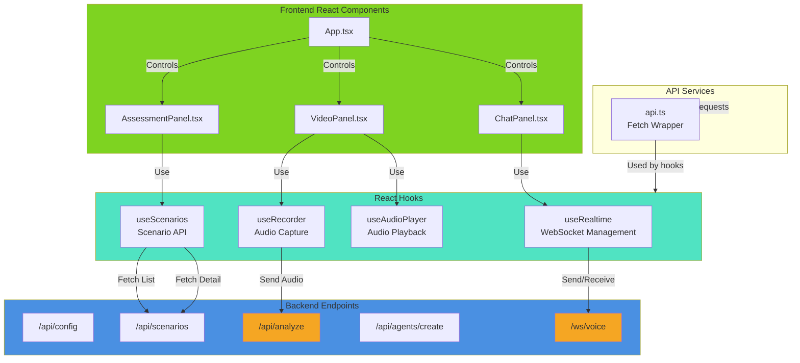
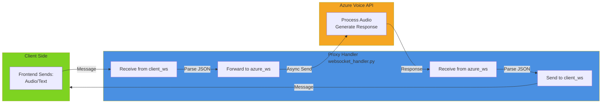
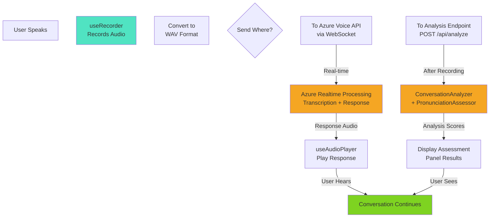
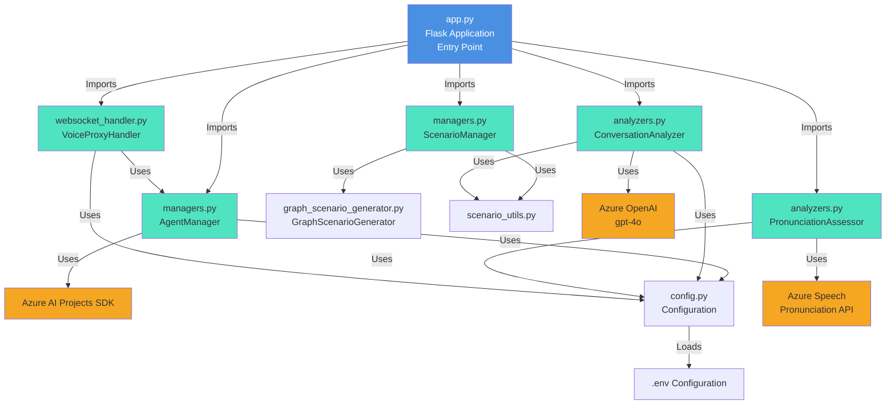

# Architecture & Data Flow Diagrams

## System Overview

This document contains sequence diagrams and data flow diagrams to help understand which parts of the code control which behavior in the MTX Emergency Dispatcher Console.

> **Scope:** this describes **live mode** (the real Azure voice pipeline). The scripted demo path
> is documented separately in [docs/DEMO_ARCHITECTURE.md](docs/DEMO_ARCHITECTURE.md).

---

## 1. High-Level System Architecture

---

## 2. WebSocket Connection & Voice Proxy Flow

---

## 3. Agent Creation & Management Flow

---

## 4. Scenario Loading & Management

---

## 5. Conversation Analysis Flow

---

## 6. Data Flow: Frontend to Backend Communication

---

## 7. Message Flow Through WebSocket

---

## 8. Audio Processing Pipeline

---

## 9. Code Module Relationships

---

## Key Behavioral Controls

### WebSocket Real-time Voice Behavior
- **Controller**: `websocket_handler.py` - `VoiceProxyHandler.handle_connection()`
- **Behavior**: Bidirectional message forwarding between client and Azure Voice API
- **Files**: `frontend/src/hooks/useRealtime.ts` (client-side)

### Patient Feedback Analysis Behavior
- **Controller**: `analyzers.py` - `ConversationAnalyzer.analyze_conversation()`
- **Behavior**: Evaluates patient feedback transcripts using Azure OpenAI against evaluation prompts
- **Scoring Categories**:
  - Patient Sentiment (40 pts): emotional tone, care satisfaction, trust & confidence
  - Service Quality (35 pts): communication, coordination, discharge process, pain management
  - Follow-up Requirements (25 pts): clinical urgency, admin follow-up, emotional support, patient education
- **Outputs**: Critical flags, key concerns, positive feedback, recommended actions, summary

### Pronunciation Assessment Behavior
- **Controller**: `analyzers.py` - `PronunciationAssessor.assess_pronunciation()`
- **Behavior**: Analyzes audio pronunciation using Azure Speech Services
- **Output**: Accuracy scores, fluency metrics, prosody assessments

### Scenario Management Behavior
- **Controller**: `managers.py` - `ScenarioManager.list_scenarios()` & `get_scenario()`
- **Behavior**: Loads emergency call scenarios from YAML files in `data/scenarios/`
- **Scenarios**: Fire, medical, accident, crime
- **Storage**: In-memory dictionary, supports both static and dynamically generated scenarios

### Agent Creation Behavior
- **Controller**: `managers.py` - `AgentManager.create_agent()`
- **Behavior**: Creates Azure AI agents for specific feedback scenarios using Azure AI Projects SDK
- **Integration**: Agents are passed to clients and used in WebSocket connections
