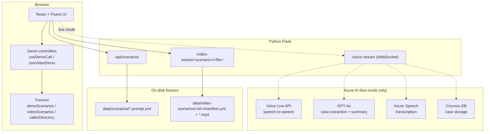

<h1 align="center">MTX Emergency Dispatcher Console</h1>

<p align="center">
  An AI-assisted emergency dispatch demo — live voice call intake and CCTV video analytics, built on Azure.
</p>

<p align="center">
  
  
  
</p>

---

## Overview

A dispatcher console that shows what changes when AI does the listening, the cross-referencing, and the
first-draft writing — while the dispatcher stays firmly in control.

The repo contains **two demo experiences**:

| Demo | What it shows |
|---|---|
| **Voice call intake** | An incoming emergency call streams a live transcript. The information panel auto-fills from caller-ID lookup, then fills further as the conversation progresses. On hang-up, an AI dispatch summary is generated across `FIRE` / `POLICE` / `MEDICAL`. A knowledge-base chat answers SOP questions mid-call. |
| **Video analytics** | A CCTV feed raises an AI trigger. The console surfaces the primary feed, three related feeds, cross-referenced prior incidents, and a drafted dispatch packet — all reviewable and editable by the operator. |

### Two run modes

- **Demo mode (scripted)** — every transcript turn, form patch, summary, and AI trigger is a fixture on
  disk. **No Azure subscription, no API keys, no microphone, no network egress.** Node + a browser is enough.
- **Live mode** — the real pipeline: Azure Voice Live API for speech-to-speech, GPT-4o for analysis,
  Azure Speech for transcription, Cosmos DB for case storage.

---

## Quick start (demo mode — no Azure needed)

```bash
cd frontend
npm install
npm run dev
# open http://localhost:5173
```

Pick **"Video: Apartment fire — Blk 84 Commonwealth Crescent"** (or any call scenario marked
`is_demo: true`) and click **Start demo**.

Vite serves the video assets directly via middleware, so the Python backend is optional here.
For full local parity — exercising the real `/api/scenarios` and `/video-assets` routes — also run:

```bash
cd backend
python -m venv .venv
source .venv/bin/activate     # Windows: .\.venv\Scripts\Activate.ps1
pip install -r requirements.txt
python -m src.app
```

No `.env` is required for demo flows. See [docs/DEMO_DEPLOYMENT_NOTES.md](docs/DEMO_DEPLOYMENT_NOTES.md).

---

## Full setup (live mode)

### Prerequisites

- **Python 3.11+**
- **Node.js 20+** and npm
- **Azure subscription** with access to:
  - [Azure AI Foundry](https://ai.azure.com/) (OpenAI models, Voice Live API)
  - [Azure Speech Services](https://azure.microsoft.com/products/ai-services/speech-services)
  - [Azure Cosmos DB](https://azure.microsoft.com/products/cosmos-db/) (case storage)
- **Azure Developer CLI (`azd`)** for cloud deployment

### Configure environment

```bash
cp .env.template .env
```

Required variables:

| Variable | Description | Default |
|---|---|---|
| `AZURE_OPENAI_ENDPOINT` | Azure OpenAI endpoint URL | — |
| `AZURE_OPENAI_API_KEY` | Azure OpenAI API key | — |
| `MODEL_DEPLOYMENT_NAME` | Model deployment name | `gpt-4.1` |
| `AZURE_AI_RESOURCE_NAME` | Azure AI resource name | — |
| `AZURE_AI_REGION` | Azure region | `swedencentral` |
| `AZURE_AI_PROJECT_NAME` | AI project name | — |
| `PROJECT_ENDPOINT` | Azure AI project endpoint | — |
| `SUBSCRIPTION_ID` | Azure subscription ID | — |
| `RESOURCE_GROUP_NAME` | Azure resource group name | — |
| `COSMOS_ENDPOINT` | Azure Cosmos DB endpoint | — |
| `COSMOS_DATABASE` | Cosmos DB database name | `emergency-cases` |

Optional variables:

| Variable | Description | Default |
|---|---|---|
| `USE_AZURE_AI_AGENTS` | Enable Azure AI Agents | `false` |
| `AGENT_ID` | Agent ID (required if agents enabled) | — |
| `AZURE_INPUT_TRANSCRIPTION_MODEL` | Speech transcription model | `azure-speech` |
| `AZURE_INPUT_TRANSCRIPTION_LANGUAGE` | Speech language | `en-US` |
| `AZURE_INPUT_NOISE_REDUCTION_TYPE` | Noise reduction type | `azure_deep_noise_suppression` |
| `AZURE_VOICE_NAME` | Voice for speech synthesis | `en-US-Ava:DragonHDLatestNeural` |
| `AZURE_VOICE_TYPE` | Voice type | `azure-standard` |
| `PORT` | Server port | `8000` |
| `HOST` | Server host | `0.0.0.0` |

### Run

```bash
# Build frontend and copy assets into the backend, then serve
./scripts/build.sh
cd backend && python src/app.py
# http://localhost:8000
```

Or run the two tiers separately for hot reload:

```bash
# Terminal 1 — backend
cd backend && PYTHONPATH="src:src/services" python -m src.app

# Terminal 2 — frontend (proxies /api and /video-assets to :8000)
cd frontend && npm run dev
```

### Deploy to Azure

```bash
azd up
```

---

## Architecture



- **Azure AI Foundry** — Voice Live API for real-time speech-to-speech; GPT-4o for 5W case extraction and dispatch summaries
- **Azure Speech Services** — transcription and noise suppression
- **React + Fluent UI** — dispatcher console interface
- **Python Flask** — REST API, static video assets, and WebSocket fan-out

**Call flow:** caller speech → Voice Live API → GPT-4o extraction → incremental form fill → dispatch summary → operator review

Full diagrams: [ARCHITECTURE_DIAGRAMS.md](ARCHITECTURE_DIAGRAMS.md) (live) · [docs/DEMO_ARCHITECTURE.md](docs/DEMO_ARCHITECTURE.md) (demo)

---

## Scenarios

**Call scenarios** (`data/scenarios/`) — fire, medical, accident, crime. Each has a `role-play`
prompt (drives the simulated caller) and an `evaluation` prompt (scores the operator's intake).

**Video scenarios** (`data/video-scenarios/`) — `apartment-commonwealthcrescent`, with a primary
feed plus three related feeds and a manifest describing triggers, incidents, and the draft summary.

Adding new scenarios is documented in [docs/DEMO_DEPLOYMENT_NOTES.md §4](docs/DEMO_DEPLOYMENT_NOTES.md).

---

## Documentation

| Doc | Contents |
|---|---|
| [docs/DEMO_REQUIREMENTS.md](docs/DEMO_REQUIREMENTS.md) | Voice-call demo spec |
| [docs/UI_UX_REQUIREMENTS.md](docs/UI_UX_REQUIREMENTS.md) | Dispatcher console layout (`C1`–`C11`) |
| [docs/VIDEO_ANALYTICS_DEMO_REQUIREMENTS.md](docs/VIDEO_ANALYTICS_DEMO_REQUIREMENTS.md) | Video demo spec (`V0`–`V8`) |
| [docs/VIDEO_ANALYTICS_DEMO_SCRIPT.md](docs/VIDEO_ANALYTICS_DEMO_SCRIPT.md) | 90-second presenter script |
| [docs/VIDEO_ANALYTICS_UI_UX_REQUIREMENTS.md](docs/VIDEO_ANALYTICS_UI_UX_REQUIREMENTS.md) | Video workspace UI spec |
| [docs/DEMO_ARCHITECTURE.md](docs/DEMO_ARCHITECTURE.md) | How scripted demo mode works |
| [docs/DEMO_DEPLOYMENT_NOTES.md](docs/DEMO_DEPLOYMENT_NOTES.md) | Running / packaging demo mode |
| [docs/EMERGENCY_INTAKE_SCRIPT.md](docs/EMERGENCY_INTAKE_SCRIPT.md) | 5W call-taker intake reference |
| [docs/TROUBLESHOOTING_DEV.md](docs/TROUBLESHOOTING_DEV.md) | Local dev issues |
| [docs/TROUBLESHOOTING_AGENT.md](docs/TROUBLESHOOTING_AGENT.md) | Agent turn-taking / VAD tuning |
| [DEPLOYMENT_NOTES.md](DEPLOYMENT_NOTES.md) | Live-mode Azure deployment |
| [docs/mockup/dispatcher-console.html](docs/mockup/dispatcher-console.html) | Static UI mockup |

---

## Development

```bash
# Tests
./scripts/test.sh

# Lint (flake8 + ESLint)
./scripts/lint.sh

# Format (black + prettier)
./scripts/format.sh
```

### Docker

```bash
# Full application
docker build -t mtx-demo -f backend/Dockerfile .
docker run -p 8000:8000 --env-file .env mtx-demo

# Demo-only image (no Azure dependencies)
docker build -t mtx-demo:demo -f backend/Dockerfile.demo .
docker run -p 8000:8000 mtx-demo:demo
```

---

## Acknowledgements

This project began as a fork of the
[Azure-Samples `voicelive-api-salescoach`](https://github.com/Azure-Samples/voicelive-api-salescoach)
demo and has been substantially rewritten for emergency dispatch. Licensed under
[MIT](LICENSE.md).

> This is a demonstration harness. It is **not** intended for production deployment and does not
> integrate with real telephony, CAD systems, or emergency services.
