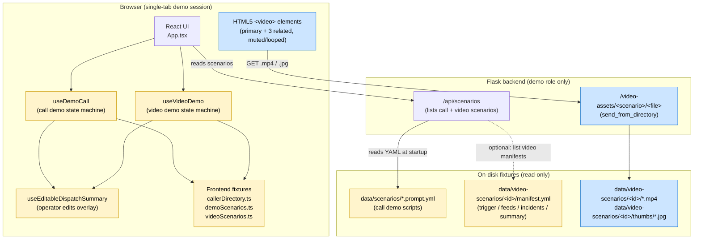
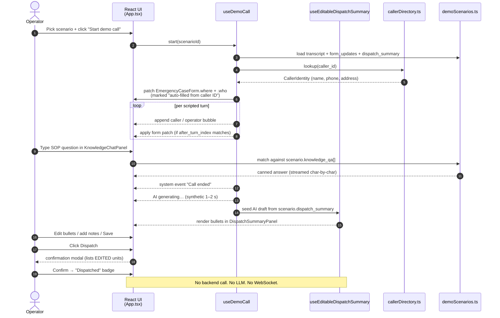
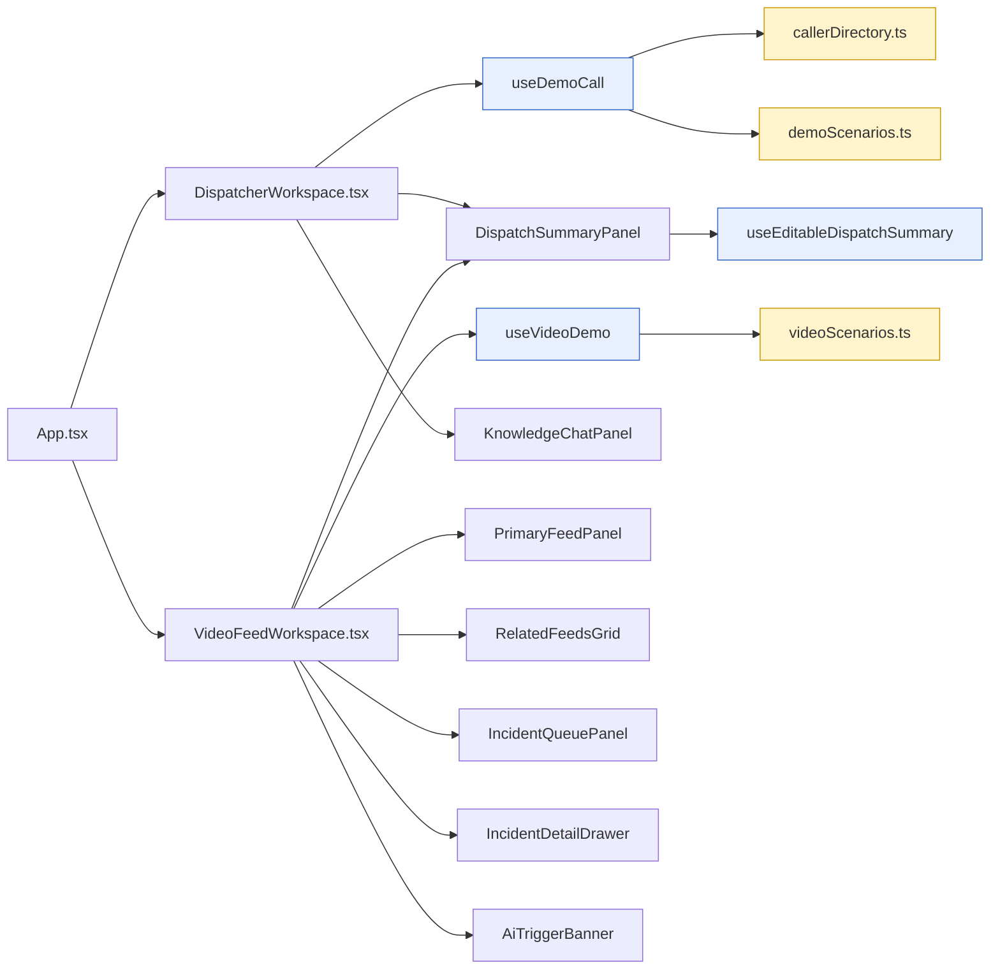

# Demo-Mode Architecture

**Document version:** 1.0
**Status:** Draft
**Owner:** Frontend / Demo
**Scope:** Mocked / scripted demo experience only — both the **voice-call demo** ([DEMO_REQUIREMENTS.md](DEMO_REQUIREMENTS.md)) and the **video-analytics demo** ([VIDEO_ANALYTICS_DEMO_REQUIREMENTS.md](VIDEO_ANALYTICS_DEMO_REQUIREMENTS.md)).
**Companion docs:** [ARCHITECTURE_DIAGRAMS.md](../ARCHITECTURE_DIAGRAMS.md) (full / live-mode architecture), [DEMO_DEPLOYMENT_NOTES.md](DEMO_DEPLOYMENT_NOTES.md).

---

## 1. Purpose & boundary

This document describes only the **mocked demo portion** of the dispatcher console. The live voice pipeline (Azure VoiceLive proxy, real-time STT/TTS, LLM analyzers, WebSocket fan-out) is documented separately in [ARCHITECTURE_DIAGRAMS.md](../ARCHITECTURE_DIAGRAMS.md) and is intentionally **not in scope** here.

**What "demo mode" means in this codebase:**

- Selected via `is_demo: true` on a scenario (call demos) or `kind: video` (video demos).
- **No outbound network calls** to Azure AI Foundry, Azure Speech, Azure OpenAI, or any LLM endpoint.
- **No microphone capture, no PSTN, no WebRTC.**
- All conversation turns, form patches, dispatch summaries, knowledge-base answers, AI triggers, related feeds, related incidents, and confidence numbers are **scripted fixtures** in YAML manifests + frontend TypeScript fixture modules.
- The backend's only demo-related role is **serving static video assets** (mp4 / jpg) under `/video-assets/<scenario>/<file>`.

This means the demo is fully runnable **without any Azure credentials**, on a developer laptop with `npm run dev` alone.

---

## 2. High-level demo architecture



### 2.1 Components owned by this doc

| Layer | Component | Role | File |
|---|---|---|---|
| Browser | `useDemoCall` | Plays scripted transcript, applies caller-ID auto-fill, applies form patches, hands off to dispatch-summary at end of call. | [frontend/src/hooks/useDemoCall.ts](../frontend/src/hooks/useDemoCall.ts) |
| Browser | `useVideoDemo` | Drives the video-analytics demo phases (idle → connecting → trigger-raised → live), exposes `trigger`, `primary`, `related`, `incidents`, `summary`. | [frontend/src/hooks/useVideoDemo.ts](../frontend/src/hooks/useVideoDemo.ts) |
| Browser | `useEditableDispatchSummary` | Overlays operator edits on top of the AI draft; supports per-bullet revert, panel-level revert, and validation. Shared by both demos. | [frontend/src/hooks/useEditableDispatchSummary.ts](../frontend/src/hooks/useEditableDispatchSummary.ts) |
| Browser | `callerDirectory.ts` | Hardcoded phone → caller identity map for the call demo's auto-fill. | [frontend/src/data/callerDirectory.ts](../frontend/src/data/callerDirectory.ts) |
| Browser | `demoScenarios.ts` | Frontend mirror of the YAML call scenarios (transcript + form-updates + canned dispatch summary + knowledge Q&A). | [frontend/src/data/demoScenarios.ts](../frontend/src/data/demoScenarios.ts) |
| Browser | `videoScenarios.ts` | Frontend mirror of the YAML video manifests + the `getVideoAssetUrl()` helper (`/video-assets/<id>/<file>`). | [frontend/src/data/videoScenarios.ts](../frontend/src/data/videoScenarios.ts) |
| Backend | `/video-assets/<scenario>/<file>` | Static-file route; resolves `/app/data/video-scenarios/...` in Docker, repo path in dev. Path-traversal safe via `send_from_directory`. | [backend/src/app.py](../backend/src/app.py) |
| Backend | `/api/scenarios` | Lists demo scenarios. | [backend/src/app.py](../backend/src/app.py) |
| Disk | `data/scenarios/*.prompt.yml` | Call-demo scripts. | [data/scenarios/](../data/scenarios/) |
| Disk | `data/video-scenarios/<id>/manifest.yml` + `*.mp4` + `thumbs/*.jpg` | Video-demo manifests + assets. | [data/video-scenarios/](../data/video-scenarios/) |

### 2.2 What is **deliberately absent** in demo mode

- **No** WebSocket connection to the backend.
- **No** call to `api.analyzeConversation()` (bypassed when `is_demo === true` per [DEMO_REQUIREMENTS.md §4.4](DEMO_REQUIREMENTS.md)).
- **No** Azure VoiceLive proxy, no `voice_proxy_handler`, no microphone permission prompt.
- **No** real CV inference — V3 highlight rectangle and per-source confidence values are static numbers from the manifest.
- **No** RAG / vector retrieval — knowledge-base answers come from the scenario's `knowledge_qa[]` array.

---

## 3. Sequence — Voice-call demo



---

## 4. Sequence — Video-analytics demo

```mermaid
sequenceDiagram
    autonumber
    actor Op as Operator
    participant UI as VideoFeedWorkspace
    participant Demo as useVideoDemo
    participant Edit as useEditableDispatchSummary
    participant Fix as videoScenarios.ts
    participant Video as &lt;video&gt; element
    participant Static as Flask /video-assets

    Op->>UI: Pick video scenario + Start demo
    UI->>Demo: start(scenario)
    Demo->>Fix: load manifest (trigger, feeds, incidents, summary)

    Note over Demo: phase: connecting (V0 shimmer)
    Demo-->>UI: phase=trigger-raised<br/>(V0 banner snaps in: P1 / HIGH / 0.94)

    Demo-->>UI: phase=live (≈1 s later)
    UI->>Video: src = /video-assets/<id>/primary.mp4
    Video->>Static: GET .mp4 (HTTP 206 range)
    Static-->>Video: video bytes
    Video-->>UI: muted/looped playback + V3 SVG overlay

    Demo-->>UI: relatedReady=true (V4 + V5 + aggregate strip)
    Demo-->>UI: incidentsReady=true (V6 sorted by relevance)
    Demo->>Edit: seed AI draft from manifest.dispatch_summary
    Edit-->>UI: V8 fades in with trigger-metadata strip

    opt Operator promotes a related feed
      Op->>UI: Click V4 tile
      UI->>Demo: promote(cameraId)
      Demo-->>UI: swap primary <-> tile (state only)
      UI->>Video: src = /video-assets/<id>/related-N.mp4<br/>(NO remount)
    end

    opt Operator opens an incident
      Op->>UI: Click V6 card
      UI-->>Op: V11 side drawer (canned data, ~300 ms synthetic delay)
    end

    opt Operator validates the trigger
      Op->>UI: Click "Acknowledge & dispatch" in V0
      Demo-->>UI: status pill: Awaiting → Acknowledged
      UI-->>Op: scroll to V8, halo V9 button
    end

    Op->>UI: (optional) Edit V8 bullets via V10
    Op->>UI: Click V9 Dispatch → confirm
    Demo-->>UI: V0 status pill: Acknowledged → Dispatched
    Note over UI: Reset demo button restores phase=idle.
```

---

## 5. Data flow — Where each piece of "AI output" actually comes from

| User-visible artifact | Real source | "AI" appearance | File |
|---|---|---|---|
| Call transcript bubbles | `scenario.transcript[]` (YAML) | Streamed at scripted `delay_ms` | [data/scenarios/](../data/scenarios/) |
| Information-panel auto-fill | `callerDirectory[caller_id]` | Snapped in on connect; per-field "auto-filled" caption | [callerDirectory.ts](../frontend/src/data/callerDirectory.ts) |
| Information-panel mid-call updates | `scenario.form_updates[]` (YAML) | Faded-in after matching transcript turn | [data/scenarios/](../data/scenarios/) |
| Knowledge-base answers | `scenario.knowledge_qa[]` (YAML) | Streamed char-by-char with Copilot icon | [data/scenarios/](../data/scenarios/) |
| Dispatch Summary (call demo) | `scenario.dispatch_summary` (YAML) | Shimmer + `AI generating…` chip, then fade-in | [data/scenarios/](../data/scenarios/) |
| V0 AI Trigger Banner (CAD ID, P1, HIGH, 0.94) | `manifest.ai_trigger.*` (YAML) | Snaps in after ~0.5 s shimmer | [data/video-scenarios/](../data/video-scenarios/) |
| V3 highlight rectangle | `manifest.primary_feed.ai_overlay.box` (YAML) | Static SVG with hard-coded `#ff7a00` stroke | [PrimaryFeedPanel.tsx](../frontend/src/components/PrimaryFeedPanel.tsx) |
| V4 evidence chips + per-source confidence | `manifest.related_feeds[].evidence_*` + `ai_trigger.evidence[]` | Rendered statically; no animation | [RelatedFeedsGrid.tsx](../frontend/src/components/RelatedFeedsGrid.tsx) |
| V5 aggregate-confidence strip | Computed from `ai_trigger.evidence[]` (sum/aggregate is **not** computed; the value comes from `ai_trigger.confidence`) | Static line | [RelatedFeedsGrid.tsx](../frontend/src/components/RelatedFeedsGrid.tsx) |
| V6 relevance bar + *Why related* | `manifest.related_incidents[].relevance` + `.relevance_reason` | Bar width proportional to score | [IncidentQueuePanel.tsx](../frontend/src/components/IncidentQueuePanel.tsx) |
| V8 Dispatch Summary (video demo) | `manifest.dispatch_summary.sections.*` (YAML) | Shimmer + `AI generating…` chip, then fade-in | [data/video-scenarios/](../data/video-scenarios/) |
| V11 Incident drawer body | Same `related_incidents[]` entry, expanded | Synthetic ~300 ms load | [IncidentDetailDrawer.tsx](../frontend/src/components/IncidentDetailDrawer.tsx) |
| Operator-edited bullets | `useEditableDispatchSummary` overlay state | Left-border + "edited" caption; per-row Revert | [useEditableDispatchSummary.ts](../frontend/src/hooks/useEditableDispatchSummary.ts) |

> **Key takeaway.** Every "AI confidence" or "AI relevance" number on screen in demo mode is a literal value from a YAML file. There is no inference, no probability calibration, no model in the loop.

---

## 6. State machines

### 6.1 Call-demo phases (`useDemoCall`)

```
idle ──Start──▶ connecting ──auto──▶ active ──final-turn──▶ ended ──draft-summary──▶ summary-ready
  ▲                                                                                       │
  └──────────────────────────── Reset call ──────────────────────────────────────────────┘
```

### 6.2 Video-demo phases (`useVideoDemo`)

```
idle ──Start──▶ connecting ──~0.5s──▶ trigger-raised ──~1s──▶ live ──auto──▶ live (related/incidents/summary populated)
  ▲                                                                                  │
  └──────────────────────── Reset demo / Dismiss as false positive ─────────────────┘
```

### 6.3 V0 trigger status pill (orthogonal to phase)

```
Awaiting validation ──Acknowledge & dispatch──▶ Acknowledged ──V9 confirm──▶ Dispatched
        │
        └─────Dismiss as false positive (confirmed)──▶ Dismissed (terminal; resets phase to idle)
```

---

## 7. Module dependency map (demo subset)



---

## 8. Trust boundaries & data sensitivity

| Boundary | What crosses | Notes |
|---|---|---|
| Browser ↔ Flask static route | HTTP `GET /video-assets/<scenario>/<file>` | Read-only. `send_from_directory` enforces path-traversal safety. No authentication in v1 (demo only). |
| Browser ↔ disk YAML | None directly — frontend uses bundled TypeScript fixtures (`videoScenarios.ts` / `demoScenarios.ts`). YAML is the source of truth for **content**; the TS files are kept manually in sync. | A future hook (see §9) replaces this with a backend manifest loader. |
| Operator edits | Live entirely in component state; wiped on Reset. | No persistence in demo mode. |
| Caller-identity directory | Static fixture, fictional numbers and names. | **No real PII**; do not commit production phone numbers. |

---

## 9. Future hooks (out of scope for demo mode)

- **Backend manifest loader.** Replace the dual-source-of-truth pattern (YAML on disk + TS fixtures bundled into the SPA) with a `/api/video-scenarios/<id>` endpoint returning the parsed manifest. The frontend would then drop `videoScenarios.ts` entirely.
- **Real CV / correlation engine.** Swap manifest-driven `ai_trigger`, `evidence`, `related_feeds`, `related_incidents` for backend endpoints; the UI contract is already shaped around this transition (see [VIDEO_ANALYTICS_DEMO_REQUIREMENTS.md §9](VIDEO_ANALYTICS_DEMO_REQUIREMENTS.md)).
- **Real LLM dispatch summary.** Re-enable `api.analyzeConversation()` for non-demo scenarios; demo mode and live mode coexist behind the `is_demo` / `kind` flags.
- **Persisted summary edits.** `PATCH /api/cases/{id}/dispatch-summary` recording each diff against the AI draft (see [DEMO_REQUIREMENTS.md §8](DEMO_REQUIREMENTS.md)).
